[](https://github.com/ambv/black)

[](https://github.com/samusram/tps_ml_discovery/actions/workflows/ci.yml)

[](https://doi.org/10.1101/2024.01.29.577750)
<div align="center">

# Highly accurate discovery of terpene synthases powered by machine learning

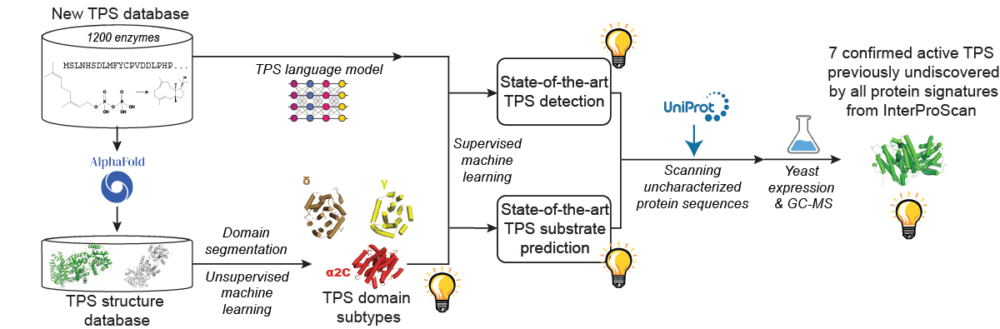
</div>

Table of contents
=================

<!--ts-->
- [Introduction](#introduction)
- [Installation](#installation)
- [Workflow](#workflow)
  - [Data Preparation](#data-preparation)
    - [1 - Sampling negative examples from Swiss-Prot](#1---sampling-negative-examples-from-swiss-prot)
    - [2 - Raw Data Preprocessing](#2---raw-data-preprocessing)
    - [3 - Computing a phylogenetic tree and clade-based sequence groups](#3---computing-a-phylogenetic-tree-and-clade-based-sequence-groups)
    - [4 - Preparing validation schema](#4---preparing-validation-schema)
  - [Structural analysis](#structural-analysis)
    - [1 - Segmentation of a TPS structure into TPS-specific domains](#1---segmentation-of-a-tps-structure-into-tps-specific-domains)
    - [2 - Pairwise comparison of the detected domains](#2---pairwise-comparison-of-the-detected-domains)
    - [3 - Clustering of the detected domains](#3---clustering-of-the-detected-domains)
  - [Predictive Modeling](#predictive-modeling)
    - [1 - Extracting numerical embeddings](#1---extracting-numerical-embeddings)
    - [2 - Training all models with hyperparameter optimization](#2---training-all-models-with-hyperparameter-optimization)
    - [3 - Evaluating performance](#3---evaluating-performance)
    - [4 - Visualization of performance](#4---visualization-of-performance)
  - [Screening large databases](#screening-large-databases)
- [Reference](#reference)
    
<!--te-->

## Introduction

Did you know that Terpene Synthases (TPSs) are responsible for the most natural scents humans have ever
experienced [[1]](https://pubmed.ncbi.nlm.nih.gov/21114471/)? Among other invaluable molecules, TPSs are also
responsible for the Nobel-prize-winning antimalarial treatment
artemisinin [[2]](https://www.ncbi.nlm.nih.gov/pmc/articles/PMC4966551/) with a market size projected to reach USD 697.9
million by 2025 [[3]](https://www.ncbi.nlm.nih.gov/pmc/articles/PMC7309871/), or TPSs are accountable for the first-line
anticancer medicine taxol with billion-dollar pick annual sales [[4]](https://pubmed.ncbi.nlm.nih.gov/33348838/).

Welcome to the GitHub repository showcasing state-of-the-art computational methods for Terpene Synthase (TPS) discovery
and characterization.

TPSs generate the scaffolds of the largest class of natural products (more than 96.000 compounds), including several
first-line
medicines [[5]](https://pubs.acs.org/doi/pdf/10.1021/acs.accounts.1c00296?casa_token=OzB4p1Y4nLoAAAAA:h85bm9CC10o33CQCMnhF1Th63mVD23YnnOGau7qhTjVhR7233XPV2-GS0LBDbIeQg-_LqjCS7ciCi7g).
Our research, outlined in *
*[the accompanying paper *Highly accurate discovery of terpene synthases powered by machine learning reveals functional
terpene cyclization in Archaea*](https://www.biorxiv.org/content/10.1101/2024.01.29.577750)**, addresses the challenge
of accurately detecting TPS activity in sequence databases.

Our approach significantly outperforms existing methods for TPS detection and substrate prediction. Using it, we
identified and experimentally confirmed the activity of seven previously unknown TPS enzymes undetected by all
state-of-the-art protein signatures integrated into InterProScan.

Notably, our method is the first to reveal functional terpene cyclization in the Archaea, one of the major domains of
life [[6]](https://www.nature.com/articles/nrmicro.2017.133).
Before our work, it was believed that Archaea can form prenyl monomers but cannot perform terpene
cyclization [[7]](https://academic.oup.com/femsre/article/47/2/fuad008/7081307). Thanks to the cyclization, terpenoids
are the largest and most diverse class of natural products. Our predictive pipeline sheds light on the ancient history
of TPS biosynthesis, which "is deeply intertwined with the establishment of biochemistry in its present
form" [[7]](https://academic.oup.com/femsre/article/47/2/fuad008/7081307).

Furthermore, the presented research unveiled a new TPS structural domain and identified distinct subtypes of known
domains, enhancing our understanding of TPS diversity and function.

This repository provides access to our approach's source codes. We invite researchers to explore, contribute, and apply
our approach to other enzyme families, accelerating biological discoveries.

## Installation

```bash
git clone https://github.com/SamusRam/TPS_ML_Discovery.git

cd TPS_ML_Discovery

. scripts/setup_env.sh
```

## Workflow

### Data Preparation

#### 1 - Sampling negative examples from Swiss-Prot

We sample negative (non-TPS) sequences from [Swiss-Prot](https://www.expasy.org/resources/uniprotkb-swiss-prot), the
expertly curated UniProtKB component produced by the UniProt consortium.
For reproducibility, we share the sampled sequences in `data/sampled_id_2_seq.pkl`.

If you want to sample Swiss-Prot entries on your own, download Swiss-Prot `.fasta` file
from [UniProt.org Downloads](https://www.uniprot.org/help/downloads) to the data folder and then run

```bash
cd TPS_ML_Discovery
conda activate tps_ml_discovery
mkdir -p outputs/logs
if [ ! -f data/sampled_id_2_seq.pkl ]; then
    python -m src.data_preparation.get_uniprot_sample \
        --uniprot-fasta-path data/uniprot_sprot.fasta \
        --output-path "data/sampled_id_2_seq.pkl" \
        --sample-size 10000 > outputs/logs/swissprot_sampling.log 2>&1
else
    echo "data/sampled_id_2_seq.pkl exists already. You might want to stash it before re-writing the file by the sampling script."
fi
```
Also, for experimental (wet-lab) validation, we sample Swiss-Prot for negative examples with the same script, while ensuring that the sampled sequences are not present in the training set.

```bash
cd TPS_ML_Discovery
conda activate tps_ml_discovery
if [ ! -f data/sampled_id_2_seq_experimental.pkl ]; then
    python -m src.data_preparation.get_uniprot_sample \
        --uniprot-fasta-path data/uniprot_sprot.fasta \
        --output-path "data/sampled_id_2_seq_experimental.pkl" \
        --blacklist-path "data/sampled_id_2_seq.pkl" \
        --sample-size 1000 > outputs/logs/swissprot_sampling_experimental.log 2>&1
else
    echo "data/sampled_id_2_seq_experimental.pkl exists already. You might want to stash it before re-writing the file by the sampling script."
fi
```

#### 2 - Raw Data Preprocessing

```bash
cd TPS_ML_Discovery
conda activate tps_ml_discovery
python -m src.data_preparation.cleaning_data_from_raw_tps_table
```
This data preprocessing script is application-specific. It would require a separate implementation for other enzyme families. 
For that reason, the script is not configurable via command line arguments.

#### 3 - Computing a phylogenetic tree and clade-based sequence groups

To check the generalization of our models to novel TPS sequences,
we need to ensure that groups of similar sequences always stay either in train or in test fold.
We construct a phylogenetic tree of our cleaned TPS dataset to compute groups of similar sequences.
Clades of the tree define the groups of similar sequences. E.g., in the following visualization of our TPS phylogenetic
subtree, the clade-based groups have the same color:

<div align="center">


</div>

We share the computed phylogenetic groups in `data/phylogenetic_clusters.pkl` for reproducibility.

To compute a clade-based sequence group on your own, run

```bash
cd TPS_ML_Discovery
conda activate tps_ml_discovery
if [ ! -f data/phylogenetic_clusters.pkl ]; then
    python -m src.data_preparation.get_phylogeny_based_clusters \
        --tps-cleaned-csv-path data/TPS-Nov19_2023_verified_all_reactions.csv \
        --n-workers 64 > outputs/logs/phylogenetic_clusters.log 2>&1
else
    echo "data/phylogenetic_clusters.pkl exists already. You might want to stash it before re-writing the file using the script for phylogenetic-tree-based sequence clustering."
fi
```

#### 4 - Preparing validation schema

We use 5-fold cross-validation (CV) for performance assessment. As described above, we ensure that similar sequences end
up
the same fold. Technically, we validate via group 5-fold CV. To ensure stable validation scores across folds,
we stratify based on the TPS substrate. As default `StratifiedGroupKFold` implementation from `sklearn.model_selection`
can result in class imbalance, we implement an iterative splitting procedure by varying random seeds and selecting the
one with the best correspondence of class proportions between folds (the proportion correspondence is compared using
Jensen–Shannon divergence).


<div align="center">

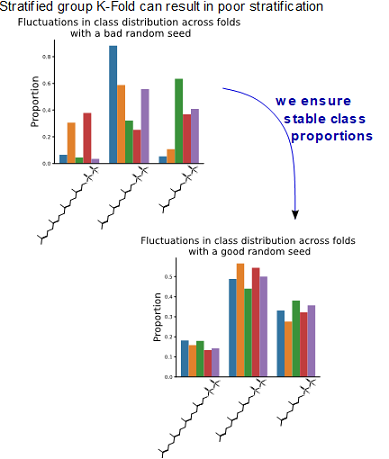

</div>

We share the computed folds in `data/tps_folds_nov2023.h5` for reproducibility.

To compute the folds on your own, run

```bash
cd TPS_ML_Discovery
conda activate tps_ml_discovery
if [ ! -f data/tps_folds_nov2023.h5 ]; then
    python -m src.data_preparation.get_balanced_stratified_group_kfolds \
        --negative-samples-path data/sampled_id_2_seq.pkl \
        --tps-cleaned-csv-path data/TPS-Nov19_2023_verified_all_reactions.csv \
        --n-folds 5 \
        --split-description stratified_phylogeny_based_split_with_minor_products \
        > outputs/logs/kfold_with_minors.log 2>&1
else
    echo "data/tps_folds_nov2023.h5 exists already. You might want to stash it before re-writing the file using the script for stratified group k-fold computation."
fi

```

Then, to store the folds in corresponding CSVs, run

```bash
cd TPS_ML_Discovery
conda activate tps_ml_discovery
python -m src.data_preparation.store_folds_into_csv \
    --negative-samples-path data/sampled_id_2_seq.pkl \
    --tps-cleaned-csv-path data/TPS-Nov19_2023_verified_all_reactions.csv \
    --kfolds-path data/tps_folds_nov2023.h5 \
    --split-description stratified_phylogeny_based_split_with_minor_products \
    > outputs/logs/kfold_with_minors_to_csv.log 2>&1
```

### Structural analysis

For the majority of proteins, AlphaFold2(AF2)-predicted structures can be downloaded
using [the following script](https://github.com/SamusRam/ProFun/blob/main/profun/utils/alphafold_struct_downloader.py)
from our [ProFun library](https://github.com/SamusRam/ProFun).
Store the structures in the `data/alphafold_structs` folder. For the remaining few without precomputed AF2 prediction,
one of the easiest ways to run AF2 is by
using [ColabFold](https://github.com/sokrypton/ColabFold) [[5]](https://www.nature.com/articles/s41592-022-01488-1) by
Mirdita M, Schütze K, Moriwaki Y, Heo L, Ovchinnikov S and Steinegger M.).

For illustration purposes, we store AF2 predictions for the archaeal TPSs we discovered in the
folder `data/alphafold_structs`.
We also put there a randomly selected TPS with UniProt accession B9GSM9, and PDBe structures we used for domain
standards.

#### 1 - Segmentation of a TPS structure into TPS-specific domains

A high-level overview of our pipeline for TPS structure segmentation into domains is depicted in the following figure:
<div align="center">

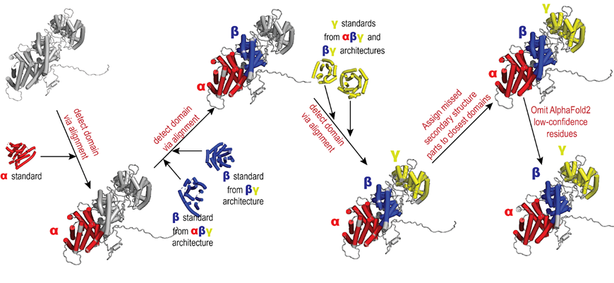

</div>

Implementation of our structural algorithms is in `utils/structural_algorithms.py`.
To use the algorithms for segmenting AF2 structures into TPS-specific domains, run

```bash
cd TPS_ML_Discovery
jupyter notebook
```

Then, execute the notebook `notebooks/notebook_2_domain_detections.ipynb`.

There you can check an interactive visualization of the TPS-domain segmentations for a randomly picked UniProt
accession.

If not running locally,
see [the notebook HTML version](https://html-preview.github.io/?url=https://github.com/SamusRam/TPS_ML_Discovery/blob/main/notebooks/notebook_2_domain_detections.html#tps_random_id_segmentation).

#### 2 - Pairwise comparison of the detected domains

To perform pairwise comparison of the detected domains with the use of the same alignment-based
algorithms from `utils/structural_algorithms.py`, run

```bash
cd TPS_ML_Discovery

python -m src.utils.compute_pairwise_similarities_of_domains \
    --name all \
    --n-jobs 64
```

If you have access to more servers,
you might want to load-balance the pairwise comparison computation across your machines as shown
in the last cell of the notebook `notebooks/notebook_2_domain_detections.ipynb`.
For convenience, we share all the raw pairwise comparison results in `data/tps_domains_and_comparisons.zip`, which are
subsequently used for domain clustering.

#### 3 - Clustering of the detected domains

For clustering, run

```bash
cd TPS_ML_Discovery
jupyter notebook
```

Then, execute the notebook `notebooks/notebook_3_clustering_domains.ipynb`.

### Predictive Modeling

#### 1 - Extracting numerical embeddings

First, we extract protein-language-model's (PLM's) embeddings.

```bash
cd TPS_ML_Discovery
conda activate tps_ml_discovery
. src/embeddings_extraction/extract_all_embeddings.sh > outputs/logs/embeddings_extraction.log 2>&1
```

#### 2 - Training all models with hyperparameter optimization

Parameters of the models and/or hyperparameter search can be modified in `configs`.

```bash
cd TPS_ML_Discovery
conda activate tps_ml_discovery
python -m src.modeling_main run > outputs/logs/models_training.log 2>&1
```

This command will automatically retrieve all models specified in the `configs` folder.
If you want to exclude some model, put `.ignore` suffix to the corresponding folder in `configs`.

If you want to run a single model, run

```bash
cd TPS_ML_Discovery
conda activate tps_ml_discovery
python -m src.modeling_main --select-single-experiment run
```

On headless servers, you would be prompted to select one of the available configs via the command line:
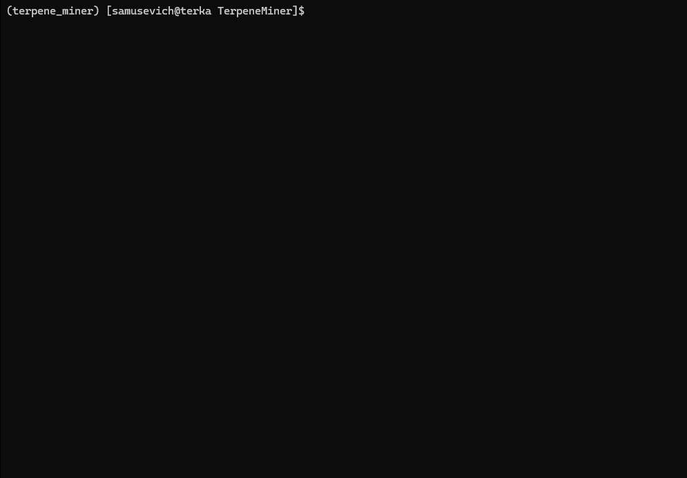
Otherwise, you can select a model via a simple GUI.

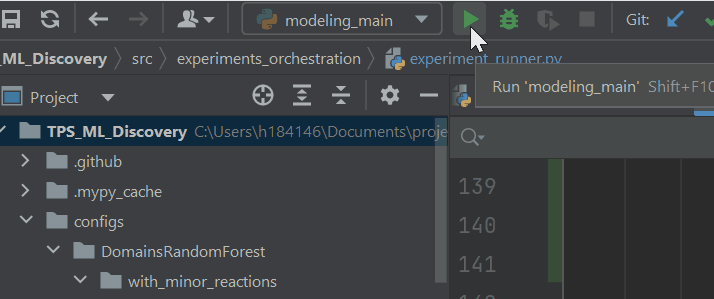

If you want to run hyperparameter optimization in parallel, you can use the following:

```bash
cd TPS_ML_Discovery
conda activate tps_ml_discovery
bash scripts/tps_tune.sh # see the script for more details and accommodate to your use case
```

For reproducability, we share outputs of the hyperparameter optimization
on [zenodo](https://zenodo.org/records/10567437) as `outputs.zip`. You can simply unzip its contents to the `outputs`
folder and run the consequent evaluation steps.

#### 3 - Evaluating performance

To evaluate all configured models, run

```bash
cd TPS_ML_Discovery
conda activate tps_ml_discovery
python -m src.modeling_main evaluate
```

Again, if you want to evaluate a single model, run

```bash
cd TPS_ML_Discovery
conda activate tps_ml_discovery
python -m src.modeling_main --select-single-experiment evaluate --output-filename single_model_specific_name
```

and select the experiment you are interested in.

To evaluate detection of the TPSs, run

```bash
python -m src.modeling_main evaluate --classes "isTPS" --output-filename tps_detection
```

To evaluate separately for individual kingdoms, run

```bash
python -m src.modeling_main evaluate --id-2-category-path data/id_2_kingdom_dataset.pkl --output-filename per_kingdom
```

Finally, to evaluate results separately per entries with and without Pfam/SUPFAM/InterPro protein signatures, run

```bash
python -m src.modeling_main evaluate --id-2-category-path data/id_2_domains_presence.pkl --output-filename per_interpro_signatures
```

#### 4 - Visualization of performance

Once the performance evaluation is done, you can visualize the results.

- To visualize main evaluation results, run

```bash
python -m src.modeling_main visualize
```

It will generate the following set of plots in the `outputs/evaluation_results`
folder (`all_results_Mean Average Precision.png, all_results_ROC-AUC.png, all_results_MCC-F1 summary.png`):

<p align="middle">
  
  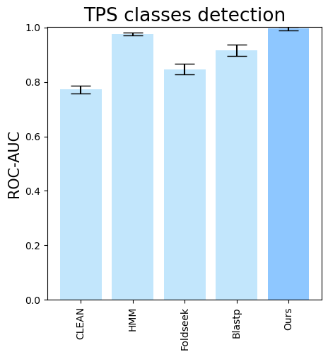 
  
</p>

- To see the isolated importance of domain-comparison features, of PLM embeddings, and PLM fine-tuning, run

```bash
python -m src.modeling_main visualize --models  \
        DomainsRandomForest__with_minor_reactions_global_tuning PlmRandomForest__esm-1v_with_minor_reactions_global_tuning PlmRandomForest__tps_esm-1v-subseq_with_minor_reactions_global_tuning PlmDomainsRandomForest__tps_esm-1v-subseq_with_minor_reactions_global_tuning_domains_subset \
        --model-names  "Domain comparisons only" "PLM only" "Finetuned PLM only" "Finetuned PLM + Domain comparisons"\
        --subset-name "ablation_study"
```

Then, the following plots will be generated in the `outputs/evaluation_results`
folder (`ablation_study_Mean Average Precision.png, ablation_study_ROC-AUC.png, ablation_study_MCC-F1 summary.png`):
<p align="middle">
  
  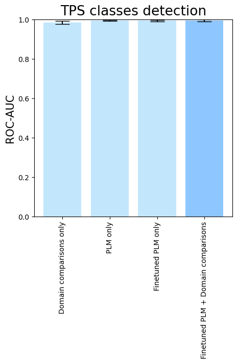 
  
</p>

- To compare different downstream classifiers on top of the same features (PLM embeddings + domain comparisons), run

```bash
python -m src.modeling_main visualize --models  \
            PlmDomainsMLP__tps_esm-1v-subseq_with_minor_reactions_global_tuning PlmDomainsLogisticRegression__tps_esm-1v_with_minor_reactions_global_tuning PlmDomainsRandomForest__tps_esm-1v-subseq_with_minor_reactions_global_tuning\
        --model-names  "Feed-Forward Neural Net" "Logistic Regression" "Random Forest"\
        --subset-name "different_models_best_feats"
```

Then, the following plots will be generated in the `outputs/evaluation_results`
folder (`different_models_best_feats_Mean Average Precision.png, different_models_best_feats_ROC-AUC.png, different_models_best_feats_MCC-F1 summary.png`):
<p align="middle">
  
  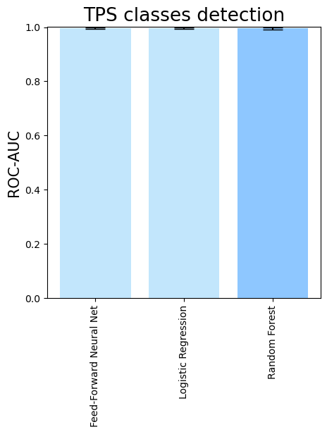 
  
</p>

- To see the performance for different PLMs, run

```bash
python -m src.modeling_main visualize --models  \
         PlmDomainsRandomForest__ankh_large_with_minor_reactions_global_tuning PlmDomainsRandomForest__ankh_base_with_minor_reactions PlmDomainsRandomForest__tps_ankh_base_with_minor_reactions PlmDomainsRandomForest__esm-2_with_minor_reactions_global_tuning PlmDomainsRandomForest__esm-1v_with_minor_reactions_global_tuning PlmDomainsRandomForest__tps_esm-1v_with_minor_reactions_global_tuning PlmDomainsRandomForest__tps_esm-1v-subseq_with_minor_reactions_global_tuning_domains_subset\
        --model-names Ankh-large Ankh Ankh-finetuned ESM-2 ESM-1v ESM-1v-finetuned ESM-1v-finetuned-subseq \
        --subset-name "random_forest_different_plm"
```

Then, the following plots will be generated in the `outputs/evaluation_results`
folder (`random_forest_different_plm_Mean Average Precision.png, random_forest_different_plm_ROC-AUC.png, random_forest_different_plm_MCC-F1 summary.png`):

<p align="middle">
  
  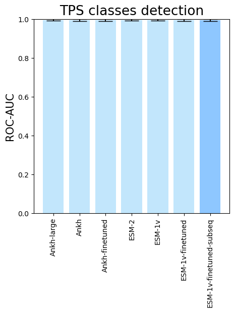 
  
</p>

- To visualize performance per different TPS types, run

```bash
python -m src.modeling_main visualize --eval-output-filename all_results --plot-boxplots-per-type --models  \
            CLEAN__with_minor_reactions HMM__with_minor_reactions Foldseek__with_minor_reactions Blastp__with_minor_reactions PlmDomainsRandomForest__tps_esm-1v-subseq_with_minor_reactions_global_tuning_domains_subset\
        --model-names CLEAN HMM Foldseek Blastp Ours         
```

The following plots will be generated in the `outputs/evaluation_results`
folder (`all_results_Average Precision_per_type.png, all_results_ROC AUC_per_type.png, all_results_MCC-F1 summary_per_type.png`):

<p align="middle">
  
   
  
</p>

- Similarly, to visualize performance separately per each kingdom, run

```bash
python -m src.modeling_main visualize --eval-output-filename all_results --plot-barplots-per-category --models  \
            CLEAN__with_minor_reactions HMM__with_minor_reactions Foldseek__with_minor_reactions Blastp__with_minor_reactions PlmDomainsRandomForest__tps_esm-1v-subseq_with_minor_reactions_global_tuning_domains_subset\
        --model-names CLEAN HMM Foldseek Blastp Ours \
        --category-name Kingdom --id-2-category-path data/id_2_kingdom_dataset.pkl --eval-output-filename per_kingdom \
        --categories-order Bacteria Fungi Plants Animals Protists Viruses Archaea
```

The following plots will be generated in the `outputs/evaluation_results`
folder (`per_kingdom_Average Precision_per_kingdom.png, per_kingdom_ROC AUC_per_kingdom.png, per_kingdom_MCC-F1 summary_per_kingdom.png`):
<p align="middle">
  
   
  
</p>

Analogously, to visualize evaluation results as barplots separately per entries with and without Pfam/SUPFAM/InterPro
protein signatures, run

```bash
python -m src.modeling_main visualize --eval-output-filename all_results --plot-barplots-per-category --models  \
            CLEAN__with_minor_reactions HMM__with_minor_reactions Foldseek__with_minor_reactions Blastp__with_minor_reactions PlmDomainsRandomForest__tps_esm-1v-subseq_with_minor_reactions_global_tuning_domains_subset\
        --model-names CLEAN HMM Foldseek Blastp Ours \
        --category-name "Protein signature" --id-2-category-path data/id_2_domains_presence.pkl --eval-output-filename per_interpro_signatures \
        --categories-order With Without

```

The following plots will be generated in the `outputs/evaluation_results`
folder (
<p align="middle">
  
   
  
</p>

##### Visualization of TPS detection performance

```bash
python -m src.modeling_main visualize --eval-output-filename tps_detection --plot-tps-detection --models  \
            PfamSUPFAM__pfam PfamSUPFAM__supfam CLEAN__with_minor_reactions HMM__with_minor_reactions Foldseek__with_minor_reactions Blastp__with_minor_reactions PlmDomainsRandomForest__tps_esm-1v-subseq_with_minor_reactions_global_tuning_domains_subset\
        --model-names Pfam SUPFAM CLEAN HMM Foldseek Blastp Ours
        
```

This will generate the following plots `outputs/evaluation_results/tps_detection_*`:

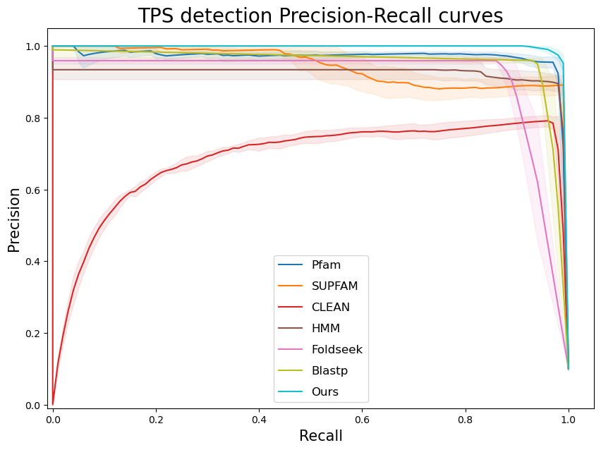

<p align="middle">
  
  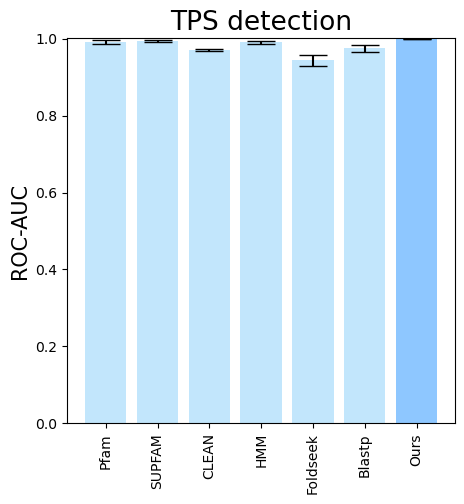 
  
</p>

This is a global mean across all TPSs. So basically, it is mainly the performance on major classes.
To see the performance for different TPS types, run commands like the following:

```bash
python -m src.modeling_main visualize --eval-output-filename all_results --plot-tps-detection --models  \
            CLEAN__with_minor_reactions HMM__with_minor_reactions Foldseek__with_minor_reactions Blastp__with_minor_reactions PlmDomainsRandomForest__tps_esm-1v-subseq_with_minor_reactions_global_tuning_domains_subset\
        --model-names CLEAN HMM Foldseek Blastp Ours \
        --subset-name "di_detection" --type-detected di
        
```

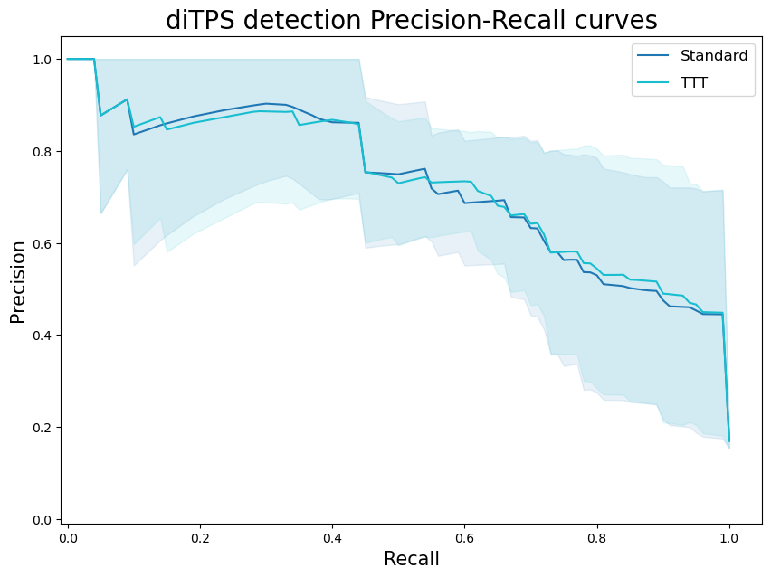

<p align="middle">
  
  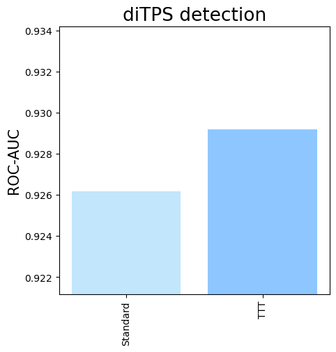 
  
</p>

```bash
python -m src.modeling_main visualize --eval-output-filename all_results --plot-tps-detection --models  \
            CLEAN__with_minor_reactions HMM__with_minor_reactions Foldseek__with_minor_reactions Blastp__with_minor_reactions PlmDomainsRandomForest__tps_esm-1v-subseq_with_minor_reactions_global_tuning_domains_subset\
        --model-names CLEAN HMM Foldseek Blastp Ours \
        --subset-name "sester_detection" --type-detected sester
        
```

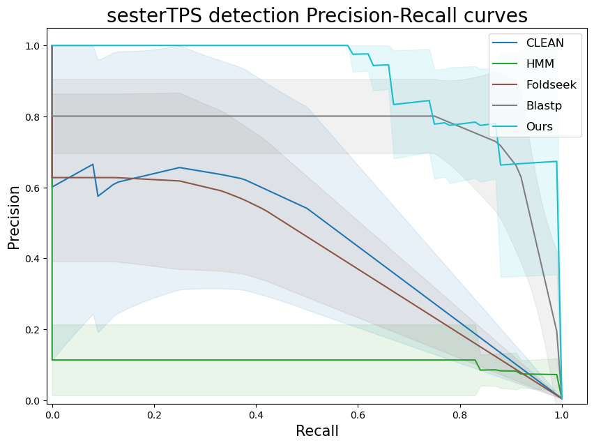

<p align="middle">
  
  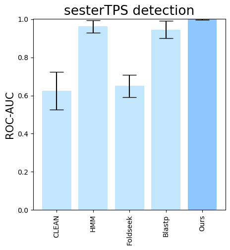 
  
</p>

### Screening large databases

Before screening large databases, you need to gather the trained models. To do so, run

```bash
cd TPS_ML_Discovery
conda activate tps_ml_discovery
python -m src.screening.gather_classifier_checkpoints --output-path data/classifier_checkpoints.pkl
```

Next, to estimate the required number of workers for the screening, run

```bash
cd TPS_ML_Discovery
conda activate tps_ml_discovery
python -m src.screening.estimate_number_of_workers --fasta-path data/uniprot_trembl.fasta --delta 40000 --n-gpus 8
```

Note that `delta` stands for the number of sequences to be processed by a single GPU on a worker.

To screen large databases, then run

```bash
sbatch --array=0-<number_of_workers> scripts/tps_screening.sh "data/uniprot_trembl.fasta" "trembl_screening_output" 0.4
```

where `<number_of_workers>` is the number of workers estimated in the previous step. Please note, that you might have no
slurm on your cluster,
and you would need to set up the cluster environment yourself.

This will store individual hits as separate files. To merge them into a single CSV file, run

```bash
cd TPS_ML_Discovery
conda activate tps_ml_discovery
python -m src.screening.gather_detections_to_csv --screening-results-root "trembl_screening/detections_plm" --output-path "trembl_screening/detections_plm/detections_first_batch.csv" --delete-individual-files
``` 

-----------------------------------------

# Reference

> Samusevich, R., Hebra, T. et al. Highly accurate discovery of terpene synthases powered by machine learning reveals
> functional terpene cyclization in Archaea. bioRxiv (
> 2024). [https://doi.org/10.1101/2024.01.29.577750](https://doi.org/10.1101/2024.01.29.577750)

```
@article{samusevich2024tps,
  title={Highly accurate discovery of terpene synthases powered by machine learning reveals functional terpene cyclization in Archaea},
  author={Samusevich, Raman and Hebra, Teo and Bushuiev, Roman and Bushuiev, Anton and {\v{C}}alounov{\'a}, Tereza and Smr{\v{c}}kov{\'a}, Helena and Chatpatanasiri, Ratthachat and Kulh{\'a}nek, Jon{\'a}{\v{s}} and Perkovi{\'c}, Milana and Engst, Martin and Tajovsk{\'a}, Ad{\'e}la and others},
  journal={bioRxiv},
  pages={2024--01},
  year={2024},
  publisher={Cold Spring Harbor Laboratory}
```

