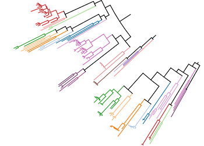

[](https://github.com/ambv/black)

[](https://github.com/SamusRam/terpene_synthases_ml/actions/workflows/ci.yml)
<div align="center">

# Discovery and Characterization of Terpene Synthases Powered by Machine Learning


</div>

## Introduction

Did you know that Terpene Synthases (TPSs) are responsible for the most natural scents human have ever experienced? [[1]](https://pubmed.ncbi.nlm.nih.gov/21114471/)

Welcome to the GitHub repository showcasing state-of-the-art methods for Terpene Synthase (TPS) discovery and characterization. 


TPSs generate the scaffolds of the largest class of natural products (more than 96.000 compounds), including several first-line medicines [[2]](https://pubs.acs.org/doi/pdf/10.1021/acs.accounts.1c00296?casa_token=OzB4p1Y4nLoAAAAA:h85bm9CC10o33CQCMnhF1Th63mVD23YnnOGau7qhTjVhR7233XPV2-GS0LBDbIeQg-_LqjCS7ciCi7g). 
Our research, outlined in **[the accompanying paper](https://www.biorxiv.org/content/10.1101/2024.01.29.577750)**, addresses the challenge of accurately detecting TPS activity in sequence databases.

Our approach significantly outperforms existing methods for TPS detection and substrate prediction. Using it, we identified and experimentally confirmed activity of seven previously unknown TPS enzymes undetected by state-of-the-art protein signatures. 

Notably, our method is the first to reveal functional terpene cyclization in the Archaea, one of the major domains of life [[3]](https://www.nature.com/articles/nrmicro.2017.133).
Before our work, it was believed that Archaea can form prenyl monomers but cannot perform terpene cyclisation [[4]](https://academic.oup.com/femsre/article/47/2/fuad008/7081307). Exactly thanks to the cyclisation, terpenoids are the largest and most diverse class of natural products. Our predictive pipeline shed light on the ancient history of TPS biosynthesis which "is deeply intertwined with the establishment of biochemistry in its present form" [[4]](https://academic.oup.com/femsre/article/47/2/fuad008/7081307).

Furthermore, the presented research unveiled a new TPS structural domain and identified distinct subtypes of known domains, enhancing our understanding of TPS diversity and function.

This repository provides access to the source codes of our approach. We invite researchers to explore, contribute, and apply it to other enzyme families accelerating biological discoveries.


## Computing Environment Setup

```bash
git clone https://github.com/SamusRam/TPS_ML_Discovery.git
cd TPS_ML_Discovery
. utils/setup_env.sh
```

## Data Preparation
### 1 - Raw Data Preprocessing

```bash
cd TPS_ML_Discovery
jupyter notebook
```
And then execute the notebook `notebooks/step_1_data_cleaning_from_raw_TPS_table.ipynb`.

### 2 - Sampling negative examples from Swiss-Prot
We sample negative (non-TPS) sequences from [Swiss-Prot](https://www.expasy.org/resources/uniprotkb-swiss-prot), the expertly curated UniProtKB component produced by the UniProt consortium. 
For reproducibility, we share the sampled sequences in `data/sampled_id_2_seq.pkl`. 

If you want to sample Swiss-Prot entries on your own, download Swiss-Prot `.fasta` file from [UniProt.org Downloads](https://www.uniprot.org/help/downloads) to the data folder and then run

```bash
cd TPS_ML_Discovery
if [ ! -f data/sampled_id_2_seq.pkl ]
then
  python -m utils.data_prep_scripts.get_uniprot_sample --uniprot-fasta-path data/uniprot_sprot.fasta --sample-size 10000 > outputs/logs/swissprot_sampling.log 2>&1
else
  echo "data/sampled_id_2_seq.pkl exists already. You might want to stash it before re-writing the file by the sampling script."
fi
```

### 3 - Computing a phylogenetic tree and clade-based sequence groups
In order to check generalization of our models to novel TPS sequences, 
we need to ensure that groups of similar sequences always stay either in train or in test fold. 
To compute groups of similar sequences, we construct a phylogenetic tree of our cleaned TPS dataset. 
Clades of the tree define the groups of similar sequences. E.g., in the following visualization of our TPS phylogenetic subtree the clade-based groups have the same color:

<div align="center">



</div>

For reproducibility, we share the computed phylogenetic groups in `data/phylogenetic_clusters.pkl`. 

To compute clade-based sequence group on your own, run
```bash
cd TPS_ML_Discovery
if [ ! -f data/phylogenetic_clusters.pkl ]
then
  python -m utils.data_prep_scripts.get_phylogeny_based_clusters --negative-samples-path data/sampled_id_2_seq.pkl --tps-cleaned-csv-path data/TPS-Nov19_2023_verified_all_reactions.csv --n-workers 64 > outputs/logs/phylogenetic_clusters.log 2>&1
else
  echo "data/phylogenetic_clusters.pkl exists already. You might want to stash it before re-writing the file by the script for phylogenetic-tree based sequence clustering."
fi
```
